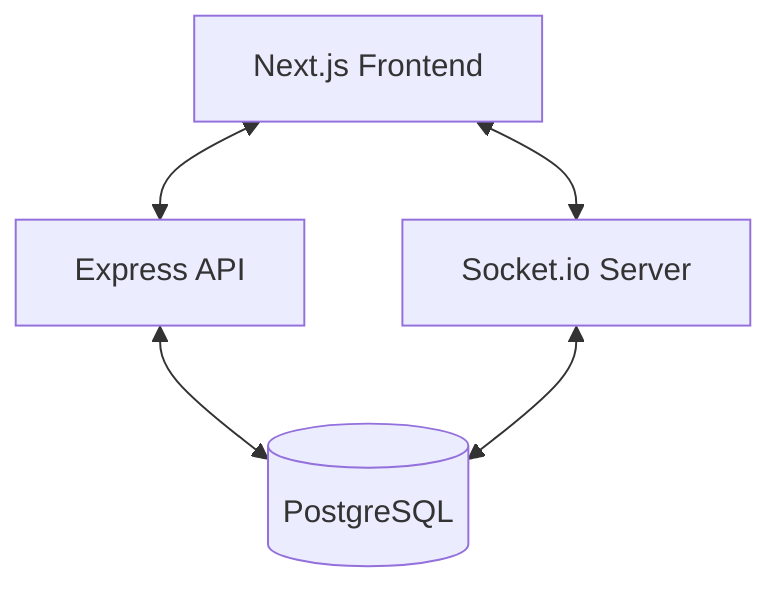

# 🧊 Cubrics - The Ultimate Speedcubing Hub

[](https://cubrics.vercel.app/)
[](https://nextjs.org/)
[](https://nodejs.org/)

**Cubrics** is a premium, all-in-one platform designed specifically for the speedcubing community. Whether you're a beginner looking for a solution or a pro tracking your sub-10 times, Cubrics provides the tools you need to excel.

---

## ✨ Key Features

- 🧩 **3D Rubik's Cube Solver**: An interactive, Three.js-powered 3D cube that solves any scramble using the efficient **Kociemba Algorithm**.
- ⏱️ **Advanced Circular Timer**: A lag-free, visually stunning timer with real-time percentile rankings and session history.
- 💬 **WhatsApp-Style Chat**: Real-time messaging with friends powered by **WebSockets** for seamless communication.
- 🌍 **Explore & Social**: Find other cubers, send friend requests, and build your cubing network.
- 🏆 **Global Leaderboard**: Compete with cubers worldwide and see where you rank in the global standings.
- 🔐 **Premium Auth**: Secure authentication with detailed profile management and personalized settings.

---

## 🛠️ Tech Stack

### Frontend
- **Framework**: [Next.js 15](https://nextjs.org/) (App Router)
- **UI Library**: [React 19](https://react.dev/) & [Tailwind CSS](https://tailwindcss.com/)
- **3D Rendering**: [Three.js](https://threejs.org/) via `@react-three/fiber`
- **Animations**: [Framer Motion](https://www.framer.com/motion/)
- **Real-time**: [Socket.io-client](https://socket.io/)

### Backend
- **Runtime**: [Node.js](https://nodejs.org/) & [Express](https://expressjs.com/)
- **ORM**: [Prisma](https://www.prisma.io/)
- **Database**: [PostgreSQL (Neon)](https://neon.tech/)
- **Authentication**: JWT & Bcrypt
- **Real-time**: [Socket.io](https://socket.io/)

---

## 🏗️ System Design

Cubrics follows a decoupled **Client-Server Architecture** designed for high performance and real-time interaction.

### Architecture Overview
1. **Frontend (Next.js)**: Server-side rendering (SSR) for SEO and static generation for performance. Client-side hydration for heavy interactive components like the 3D Solver and Timer.
2. **Backend (Express)**: A RESTful API handling authentication, database operations, and user logic.
3. **WebSockets (Socket.io)**: A persistent bidirectional connection for real-time chat, friend notifications, and live leaderboard updates.
4. **Database (Prisma/Postgres)**: Organized schema for users, timer records, friend relations, and messages.



---

## 🚀 Local Setup Guide

Follow these steps to get Cubrics running on your local machine.

### 1. Clone the Repository
```bash
git clone https://github.com/shaikjunaidsami/Cubrics.git
cd Cubrics
```

### 2. Backend Setup
```bash
cd backend
npm install
```
Create a `.env` file in the `backend` folder and add the following:
```env
PORT=7777
DATABASE_URL="your_postgresql_connection_string"
JWT_SECRET="your_random_secret_string"
FRONTEND_URL="http://localhost:3000"
```
Initialize the database:
```bash
npx prisma generate
npx prisma db push
npm run dev
```

### 3. Frontend Setup
```bash
cd ../frontend
npm install
```
Create a `.env.local` file in the `frontend` folder:
```env
NEXT_PUBLIC_API_URL="http://localhost:7777"
```
Run the development server:
```bash
npm run dev
```

The application should now be accessible at `http://localhost:3000`.

---

## 🌐 Deployment

- **Frontend**: Deployed on **Vercel** with automatic CI/CD.
- **Backend**: Hosted on a Node.js environment (e.g., DigitalOcean/Render/Railway).
- **Database**: **Neon PostgreSQL**.

Live URL: [https://cubrics.vercel.app/](https://cubrics.vercel.app/)

---

## 🖼️ Preview

> [!TIP]
> Check out the stunning UI with glassmorphism effects and smooth transitions!
> *Screenshots coming soon...*

---

Made with ❤️ for the Cubing Community.
